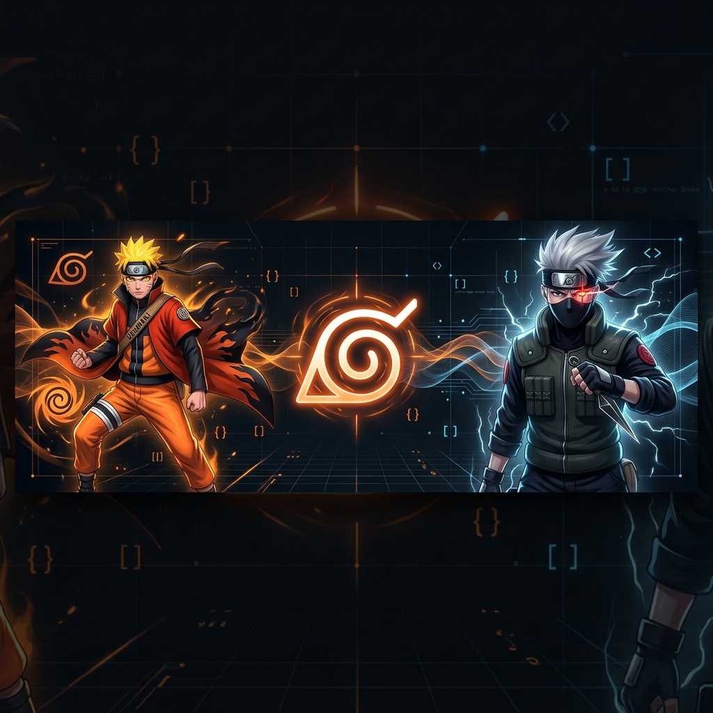

  

<h1 align="center" style="border: none;">Gustavo Ccama</h1>

  

  
  
  
  

 

##  About Me

- I am a Computer Science student at Universidad Nacional de San Agustín.
- I love using Software as a solution for every problem.
- I am a competitive programmer active on Codeforces, Atcoder, Leetcode, and Codechef.
- I am currently focused on learning Computer Science and Software Engineering.
- I am open to new job opportunities. Here is my [Resume / CV](http://lnkiy.in/Ahmed_Hossam_Resume).
- You can visit my personal [Website](https://cutt.ly/Ahmed_Hossam_Website).

 
 

##  Technical Skills

### Languages
 
 &nbsp;
 &nbsp;
 &nbsp;
 &nbsp;
 &nbsp;
 &nbsp;

 

### Frameworks & Libraries
 
 &nbsp;
 &nbsp;

 

### Databases
 
 &nbsp;
 &nbsp;

 

### Cloud & OS
 
 &nbsp;
 &nbsp;
 &nbsp;
 &nbsp;

 
 

##  Snake Eating My Contributions Graph

  <picture>
    <source media="(prefers-color-scheme: dark)" srcset="https://raw.githubusercontent.com/lorsgusty07/lorsgusty07/output/github-contribution-grid-snake-dark.svg">
    <source media="(prefers-color-scheme: light)" srcset="https://raw.githubusercontent.com/lorsgusty07/lorsgusty07/output/github-contribution-grid-snake.svg">
    
  </picture>

